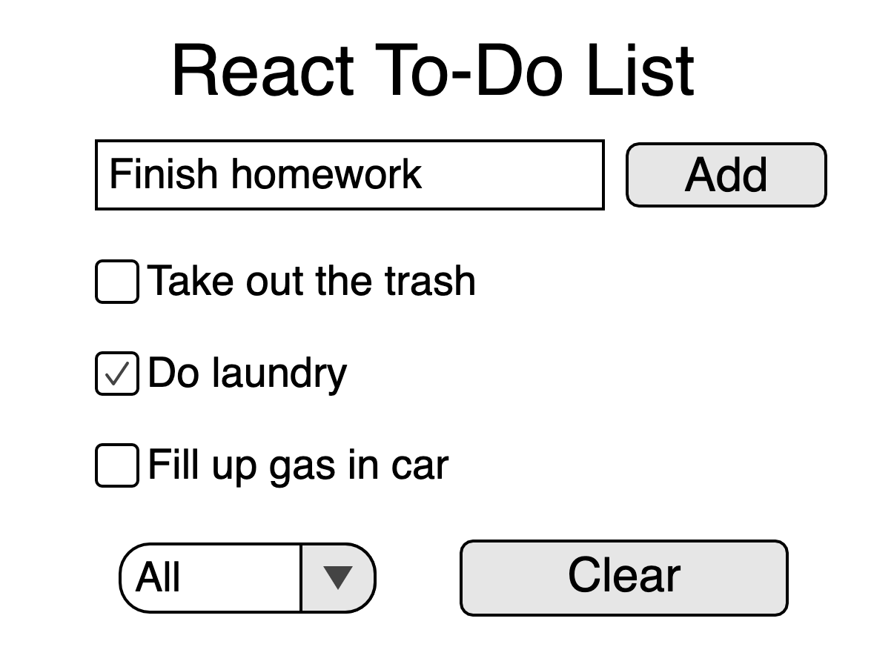

# react-to-do-list

### Description

A basic [React](http://reactjs.org) web-app built for learning purposes. Inspired by a similar exercise found in Microsoft's [frontend bootcamp](https://github.com/microsoft/frontend-bootcamp). Styled with [Sass](https://sass-lang.com/).

### How to Run

Clone this repository somewhere on your machine by running\
\
**HTTPS:**

```sh
git clone https://github.com/bdavs3/react-to-do-list.git
```

**SSH:**

```sh
git clone git@github.com:bdavs3/react-to-do-list.git
```

Then, to install dependencies, simply run\
\
**NPM:**

```sh
npm install
```

**Yarn:**

```sh
yarn install
```

You'll find the app at localhost:3000 in your browser by running\
\
**NPM:**

```sh
npm start
```

**Yarn:**

```sh
yarn start
```

### Intended Behavior

- Add items to the to-do list by typing in a text field and clicking a button or pressing 'enter'
- Check mark the items when they are finished
- Remove items that are finished by pressing a 'clear completed items' button
- Switch between three views: 'all', 'to-do', and 'completed'

##### Here's what I have in mind:

<div style="text-align: center;"></img></div>

### Road-blocks

This is where I'll keep track of significant struggles I have in the process of coding this.

- Data flow: I was having trouble figuring out how to pass data from one component to another. For example, I wanted the `Header`'s `add` button to take the value of the text field in Header and create a `ListItem` from that which is added to the `List`. I knew this would involve using React's [state](https://reactjs.org/docs/state-and-lifecycle.html) and [props](https://reactjs.org/docs/components-and-props.html), but I wasn't sure exactly what to do. I found that having functions live together in the `App.js` file (which you pass as props to the individual components) works quite well. These functions should be ones involving multiple components
- App state functions: I leaned heavily on the [Microsoft frontend bootcamp](https://github.com/microsoft/frontend-bootcamp) approach to maintaining state for this application. I needed help in figuring out how to write functions that alter this state in order to add new items to the list or mark items as completed.

### Things I Learned

- Sass has a lot of useful features and I don't think I'll ever just use vanilla CSS again
- CSS resets provide a clean slate for starting projects without browser [user agent stylesheets](https://www.chainsawonatireswing.com/2016/09/20/web-browser-default-css-files/) getting in the way
- Pass a `key` prop to list item React components so they may be uniquely identified. If you don't do that, you'll see this console message: `Warning: Each child in a list should have a unique "key" prop`.
- Javascript Array methods like `map` and `filter` are not things I have used much before, but they are great
